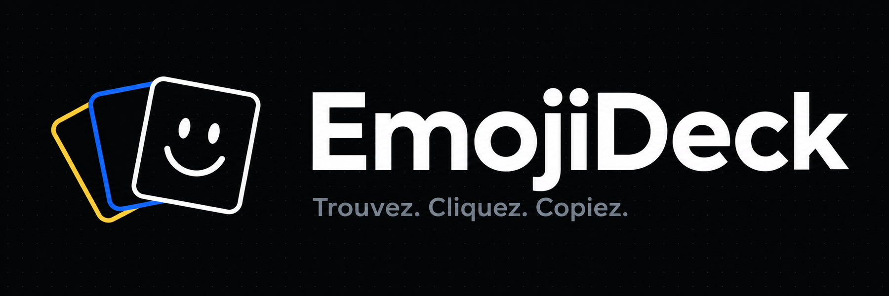

<p align="center">
  
</p>

<p align="center">
  <a href="../README.md"> Français</a>
  /
  <a href="README.en.md"> English</a>
</p>

<p align="center">
  <a href="https://karlos-fr.github.io/emojideck/"><strong>Open EmojiDeck</strong></a>
</p>

# EmojiDeck

Fast, lightweight, multilingual emoji picker for finding and copying an emoji in seconds.

EmojiDeck is a static, responsive web application with no user account. It runs entirely in the browser: no backend, cookies, advertising, or tracking. Preferences, recent emojis, and favorites remain stored locally on the device.

## Features

- Complete catalog of **1,914 Unicode 17.0 emojis** and **2,030 skin-tone variants**.
- Localized search through CLDR names, keywords, and synonyms.
- Search scoped to the active category, with an `All` category for the full catalog.
- Categories: Smileys, People, Animals, Food, Activities, Travel, Objects, Symbols, and Flags.
- One-click clipboard copy with discreet confirmation.
- Recent emoji history and favorites collection.
- Default skin tone and per-emoji variant picker.
- French, English, German, Italian, Spanish, and Portuguese interface.
- Light, dark, and system themes stored locally.
- Compact or expanded responsive layout for desktop and mobile.
- Full keyboard navigation: `Ctrl+F` or `Cmd+F`, arrow keys, `Home`, `End`, and `Escape`.
- On-demand locale catalogs and progressive rendering for large categories.

## Usage

1. Choose a category or `All`.
2. Browse the grid or enter a word in search.
3. Click an emoji to copy it.
4. Use the star action to add it to favorites.
5. For a compatible emoji, open the tone picker through its small action, a right click, or a long press.

Language, theme, skin tone, and layout preferences are stored in `localStorage`. Recents and favorites are stored there as well, with no external synchronization.

## Languages

EmojiDeck resolves the interface language in this order:

```text
user-selected language
        ↓
localStorage
        ↓
navigator.languages
        ↓
English
```

Interface messages live in `src/i18n/messages.ts`. Emoji annotations come from Unicode CLDR data and are generated as an independent chunk for every locale:

- `fr` — Français;
- `en` — English;
- `de` — Deutsch;
- `it` — Italiano;
- `es` — Español;
- `pt` — Português.

## Emoji Data

The `scripts/generate-emoji-data.mjs` script converts Unicode CLDR annotations into catalogs optimized for the application. Skin tones are attached to their parent emoji rather than displayed as independent entries.

```powershell
npm run data:generate
npm run data:check
```

The generated `src/data/generated/manifest.json` records Unicode and CLDR versions together with the source locations.

## Architecture

```text
src/
├── data/       # Generated catalogs, categories, and search engine
├── i18n/       # Locale detection and interface messages
├── storage/    # Recents, favorites, and local preferences
├── theme/      # Light, dark, and system theme resolution
├── ui/         # Progressive and interactive result rendering
├── app.ts      # Application orchestration
├── main.ts     # Entry point
└── styles.css  # Responsive desktop and mobile interface

scripts/        # CLDR generation and quality checks
e2e/            # Chromium and Firefox Playwright journeys
docs/           # Design documentation and technical notes
public/         # Favicons and public assets
```

The application uses TypeScript and Vite without a UI framework. Locale catalogs are loaded dynamically so the browser only downloads the data it needs.

## Requirements

- Node.js 20.19 or later;
- npm 10 or later;
- a modern browser with clipboard access.

## Development

```powershell
npm install
npm run dev
```

Vite prints the local URL to open in a browser.

## Build

```powershell
npm run build
npm run preview
```

The static website is generated in `dist/`.

## Verification

```powershell
npm test
npm run typecheck
npm run build
npm run quality:check
npm run test:browser
npm run data:check
```

Tests cover the catalog, search, local preferences, keyboard accessibility, themes, localization, and desktop/mobile viewports. Quality checks also enforce JavaScript and CSS budgets and verify that application code contains no tracking, cookie access, or backend URL.

## Privacy

- No user account.
- No application backend.
- No cookies.
- No tracking.
- No advertising.
- Personal data and preferences remain in the browser.

## Technical Choices

- TypeScript and Vite.
- Unicode 17.0 and CLDR 48.2 data.
- Framework-free interface designed as a real emoji picker.
- Lazy-loaded locale catalogs.
- Progressive rendering and off-screen element containment.
- Lucide interface icons.
- Vitest, JSDOM, and Playwright tests.
